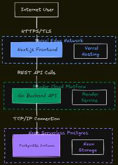
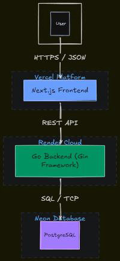
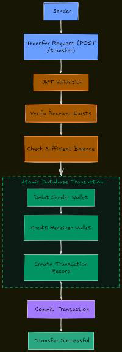
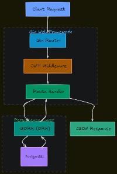
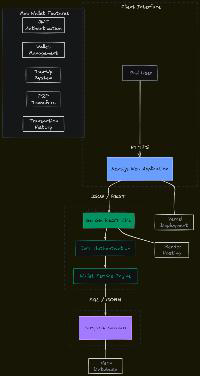

# Mini Wallet

<p align="center">
  
</p>

A full-stack digital wallet application that enables users to securely register, authenticate, manage wallet balances, transfer funds, and track transaction history.

Built to explore fintech system fundamentals, secure authentication, transaction processing, REST API design, database transactions, and cloud deployment using modern technologies.

---

## Features

### Authentication
- User Registration
- User Login
- JWT Authentication
- Protected API Routes
- Password Hashing with bcrypt

### Wallet Management
- Wallet Creation
- Balance Tracking
- Wallet Top-Up

### Transactions
- Peer-to-Peer Transfers
- Transaction History
- Atomic Database Transactions
- Transfer Validation

### Deployment
- Frontend deployed on Vercel
- Backend deployed on Render
- PostgreSQL hosted on Neon

---

## Tech Stack

| Category | Technology |
|-----------|------------|
| Frontend | Next.js, React, TypeScript, Tailwind CSS |
| Backend | Go, Gin |
| Database | PostgreSQL, GORM |
| Authentication | JWT, bcrypt |
| Hosting | Vercel, Render, Neon |

---

# Architecture

<p align="center">
  
</p>

### Architecture Overview

The application follows a monolithic backend architecture.

1. Users interact with the Next.js frontend.
2. The frontend communicates with the Go backend through REST APIs.
3. JWT authentication secures protected routes.
4. Business logic is handled through Gin handlers.
5. Data is persisted in PostgreSQL hosted on Neon.
6. The backend is deployed on Render while the frontend is deployed on Vercel.

---

# Authentication Flow

<p align="center">
  
</p>

### Registration

1. User submits registration details.
2. Password is hashed using bcrypt.
3. User record is stored in PostgreSQL.
4. A wallet is automatically created.

### Login

1. User submits email and password.
2. Credentials are validated.
3. JWT token is generated.
4. Protected endpoints require the token.

---

# Wallet Operations

<p align="center">
  
</p>

Users can:

- View wallet details
- Check balance
- Add funds through top-up
- Transfer funds to another user
- View transaction history

---

# Money Transfer Process

<p align="center">
  
</p>

### Transfer Validation

Before executing a transfer, the system validates:

- Sender authentication
- Recipient existence
- Sufficient balance
- Valid transfer amount

Transfers are executed inside a database transaction to ensure consistency and prevent partial updates.

---

# Database Schema

<p align="center">
  
</p>

### Core Entities

#### Users
Stores user account information and authentication credentials.

#### Wallets
Maintains wallet balances associated with users.

#### Transactions
Records all wallet operations including transfers and top-ups.

---

# Deployment Architecture

<p align="center">
  
</p>

### Infrastructure

| Component | Provider |
|------------|-----------|
| Frontend | Vercel |
| Backend | Render |
| Database | Neon PostgreSQL |

---

# Project Structure

```text
.
├── cmd/
│   └── server/
│       └── main.go
│
├── config/
│   └── config.go
│
├── internal/
│   ├── constants/
│   │   └── transaction.go
│   │
│   ├── database/
│   │   └── db.go
│   │
│   ├── handlers/
│   │   ├── auth.go
│   │   ├── health.go
│   │   ├── transaction.go
│   │   ├── user.go
│   │   └── wallet.go
│   │
│   ├── middleware/
│   │   └── jwt.go
│   │
│   ├── models/
│   │
│   ├── routes/
│   │   └── routes.go
│   │
│   └── utils/
│
├── go.mod
├── go.sum
└── README.md
```

---

# API Endpoints

## Authentication

| Method | Endpoint |
|----------|----------|
| POST | `/register` |
| POST | `/login` |

---

## User

| Method | Endpoint |
|----------|----------|
| GET | `/me` |

---

## Wallet

| Method | Endpoint |
|----------|----------|
| GET | `/wallet` |
| POST | `/wallet/topup` |
| POST | `/wallet/transfer` |

---

## Transactions

| Method | Endpoint |
|----------|----------|
| GET | `/transactions` |

---

## Health

| Method | Endpoint |
|----------|----------|
| GET | `/health` |

---

# Local Development Setup

## Prerequisites

- Go 1.24+
- PostgreSQL
- Node.js
- npm

---

## Clone Repository

```bash
git clone <repository-url>

cd mini-wallet
```

---

## Backend Setup

```bash
go mod tidy

go run cmd/server/main.go
```

---

## Environment Variables

Create a `.env` file:

```env
DB_HOST=
DB_PORT=
DB_USER=
DB_PASSWORD=
DB_NAME=

JWT_SECRET=
```

---

## Frontend Setup

```bash
npm install

npm run dev
```

---

# Challenges & Learnings

During development, several real-world engineering challenges were addressed:

- Designing wallet balance management
- Executing atomic money transfers using database transactions
- Structuring a scalable Go backend
- Connecting cloud-hosted PostgreSQL databases
- Managing deployment across Render, Neon, and Vercel
- Handling environment variables and production configuration

---

# Future Improvements

- Refresh Tokens
- Email Verification
- Two-Factor Authentication
- Rate Limiting
- Pagination
- Transaction Export (CSV/PDF)
- Audit Logs
- Admin Dashboard
- Real-Time Notifications
- Multi-Currency Wallet Support

---

# Author

**Farhan Khan**

B.Tech Computer Science Engineering

Built as a portfolio project to explore backend engineering, fintech systems, secure authentication, database transactions, and cloud-native deployment.