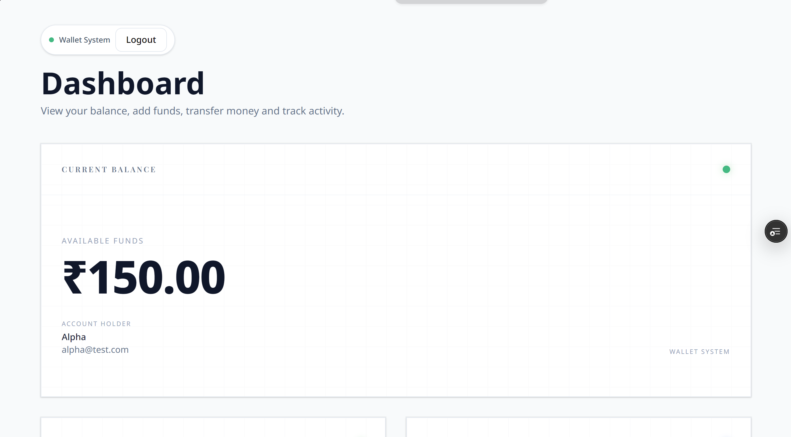
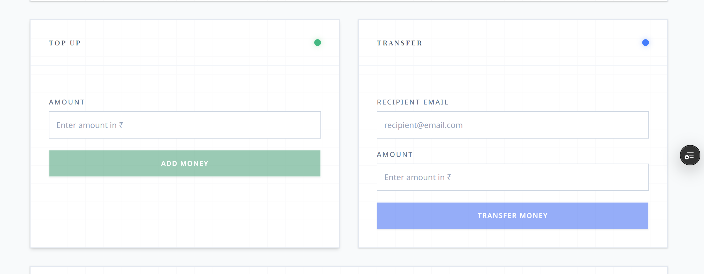
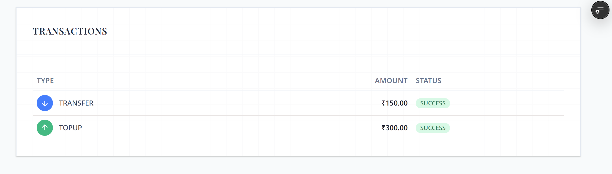
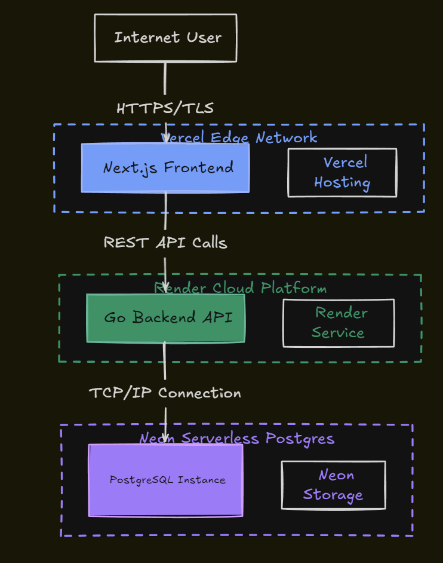
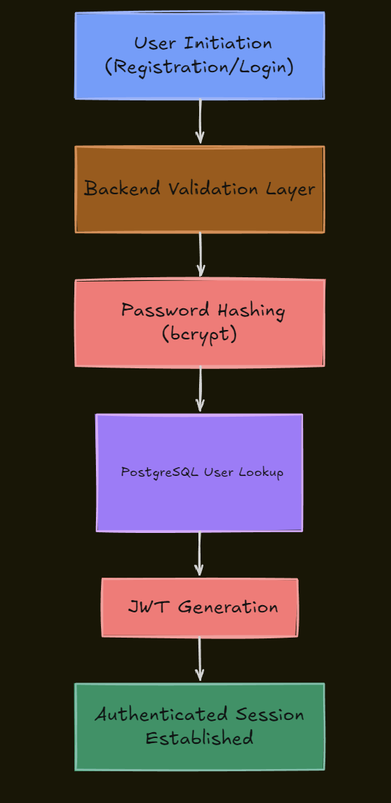
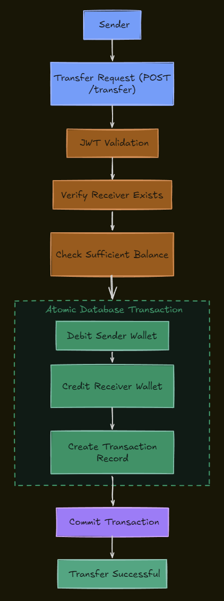
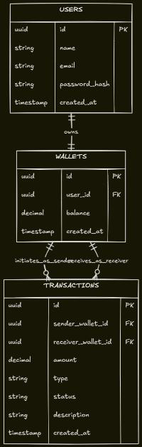
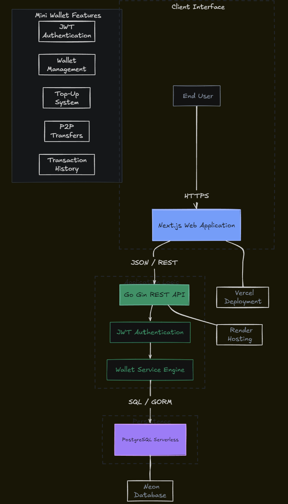

# Mini Wallet

A full-stack digital wallet application that enables users to securely register, authenticate, manage wallet balances, transfer funds, and track transaction history.

Built to explore fintech system fundamentals, secure authentication, transaction processing, database transactions, REST API design, and cloud deployment using modern technologies.

---

## Features

### Authentication

* User Registration
* User Login
* JWT Authentication
* Protected API Routes
* Password Hashing using bcrypt

### Wallet Management

* Wallet Creation
* Wallet Balance Tracking
* Wallet Top-Up

### Transactions

* Peer-to-Peer Transfers
* Transaction History
* Atomic Database Transactions
* Transfer Validation

### Deployment

* Frontend deployed on Vercel
* Backend deployed on Render
* PostgreSQL hosted on Neon

---

# Application Preview

## Dashboard Overview

<p align="center">
  
</p>

Displays wallet balance, account information, and current wallet status.

---

## Wallet Operations

<p align="center">
  
</p>

Users can top up their wallet balance and transfer funds to other registered users.

---

## Transaction History

<p align="center">
  
</p>

Tracks wallet activity including transfers and top-ups with transaction status information.

---

## Tech Stack

| Category       | Technology                               |
| -------------- | ---------------------------------------- |
| Frontend       | Next.js, React, TypeScript, Tailwind CSS |
| Backend        | Go, Gin                                  |
| Database       | PostgreSQL, GORM                         |
| Authentication | JWT, bcrypt                              |
| Hosting        | Vercel, Render, Neon                     |

---

# System Architecture

<p align="center">
  
</p>

### Architecture Overview

The application follows a monolithic architecture consisting of a Next.js frontend, a Go backend built with Gin, and a PostgreSQL database hosted on Neon.

**Flow**

1. Users interact with the Next.js frontend.
2. The frontend communicates with the backend using REST APIs.
3. JWT middleware protects secured endpoints.
4. Business logic is handled by Go services and route handlers.
5. Data is stored in PostgreSQL through GORM.
6. Services are deployed on Vercel, Render, and Neon.

---

# Authentication Flow

<p align="center">
  
</p>

### Registration Process

1. User submits registration details.
2. Password is hashed using bcrypt.
3. User information is stored in PostgreSQL.
4. A wallet is automatically created.

### Login Process

1. User submits credentials.
2. Credentials are validated.
3. JWT token is generated.
4. Token is returned to the client.
5. Protected endpoints require the token.

---

# Transfer Processing

<p align="center">
  
</p>

### Transfer Validation

Before executing a transfer, the system verifies:

* User authentication
* Recipient existence
* Valid transfer amount
* Sufficient sender balance

### Atomic Transactions

Transfers are executed inside a database transaction to ensure consistency.

The system:

1. Debits the sender wallet.
2. Credits the receiver wallet.
3. Creates a transaction record.
4. Commits all changes together.

This prevents partial updates and maintains financial consistency.

---

# Database Schema

<p align="center">
  
</p>

### Core Entities

#### Users

Stores account information and authentication credentials.

#### Wallets

Maintains wallet balances linked to individual users.

#### Transactions

Stores transfer and wallet activity records.

### Relationships

* One User owns one Wallet.
* One Wallet can participate in many Transactions.
* Transactions track both sender and receiver wallets.

---

# Deployment Architecture

<p align="center">
  
</p>

### Infrastructure

| Component | Provider        |
| --------- | --------------- |
| Frontend  | Vercel          |
| Backend   | Render          |
| Database  | Neon PostgreSQL |

---

# Project Structure

```text
.
├── cmd/
│   └── server/
│       └── main.go
│
├── config/
│   └── config.go
│
├── internal/
│   ├── constants/
│   │   └── transaction.go
│   │
│   ├── database/
│   │   └── db.go
│   │
│   ├── handlers/
│   │   ├── auth.go
│   │   ├── health.go
│   │   ├── transaction.go
│   │   ├── user.go
│   │   └── wallet.go
│   │
│   ├── middleware/
│   │   └── jwt.go
│   │
│   ├── models/
│   │
│   ├── routes/
│   │   └── routes.go
│   │
│   └── utils/
│
├── go.mod
├── go.sum
└── README.md
```

---

# API Endpoints

## Authentication

| Method | Endpoint    |
| ------ | ----------- |
| POST   | `/register` |
| POST   | `/login`    |

---

## User

| Method | Endpoint |
| ------ | -------- |
| GET    | `/me`    |

---

## Wallet

| Method | Endpoint           |
| ------ | ------------------ |
| GET    | `/wallet`          |
| POST   | `/wallet/topup`    |
| POST   | `/wallet/transfer` |

---

## Transactions

| Method | Endpoint        |
| ------ | --------------- |
| GET    | `/transactions` |

---

## Health

| Method | Endpoint  |
| ------ | --------- |
| GET    | `/health` |

---

# Local Development Setup

## Prerequisites

* Go 1.24+
* PostgreSQL
* Node.js
* npm

---

## Clone Repository

```bash
git clone <repository-url>

cd mini-wallet
```

---

## Install Dependencies

```bash
go mod tidy
```

---

## Configure Environment Variables

Create a `.env` file:

```env
DB_HOST=
DB_PORT=
DB_USER=
DB_PASSWORD=
DB_NAME=

JWT_SECRET=
```

---

## Run Backend

```bash
go run cmd/server/main.go
```

Server starts on:

```text
http://localhost:8080
```

---

# Challenges & Learnings

During development, several real-world engineering challenges were addressed:

* Designing secure JWT authentication workflows
* Implementing password hashing with bcrypt
* Managing wallet balances safely
* Executing atomic money transfers using database transactions
* Structuring a scalable Go backend
* Connecting cloud-hosted PostgreSQL databases
* Deploying services across Render, Neon, and Vercel
* Managing environment variables across environments

---

# Future Improvements

* Refresh Tokens
* Email Verification
* Rate Limiting
* Two-Factor Authentication
* Pagination
* Transaction Export (CSV/PDF)
* Audit Logs
* Admin Dashboard
* Real-Time Notifications
* Multi-Currency Support

---

# Author

**Farhan**

B.Tech Computer Science Engineering

Built as a portfolio project to explore backend engineering, fintech systems, secure authentication, database transactions, and cloud-native deployment.
